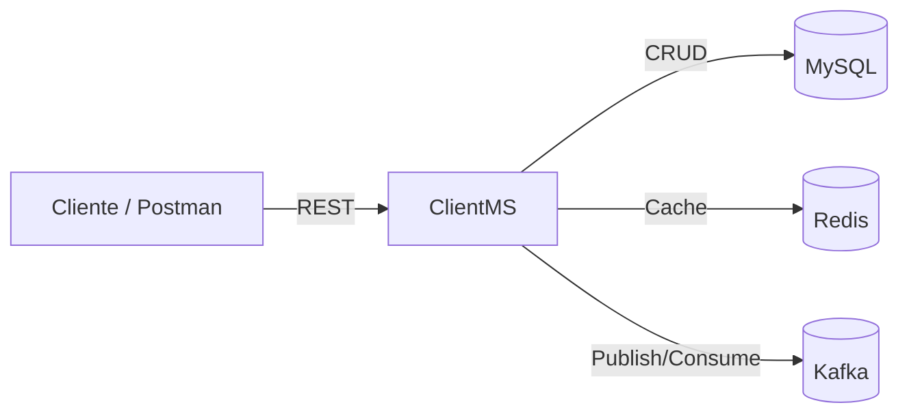

# Arquitectura ClientMS (Mermaid)

```mermaid
flowchart LR
    A[Cliente / Postman] -->|REST| S[ClientMS]
    S -->|CRUD| DB[(MySQL)]
    S -->|Cache| R[(Redis)]
    S -->|Publish/Consume| K[(Kafka)]
```
